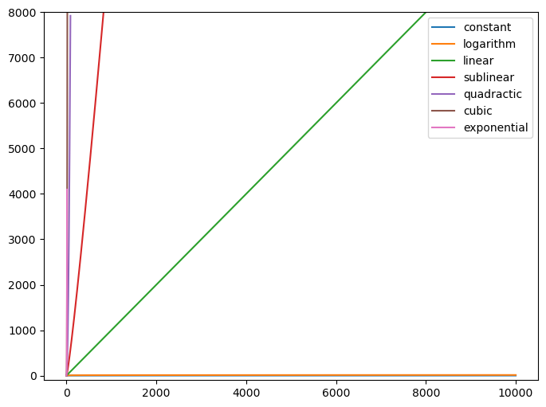
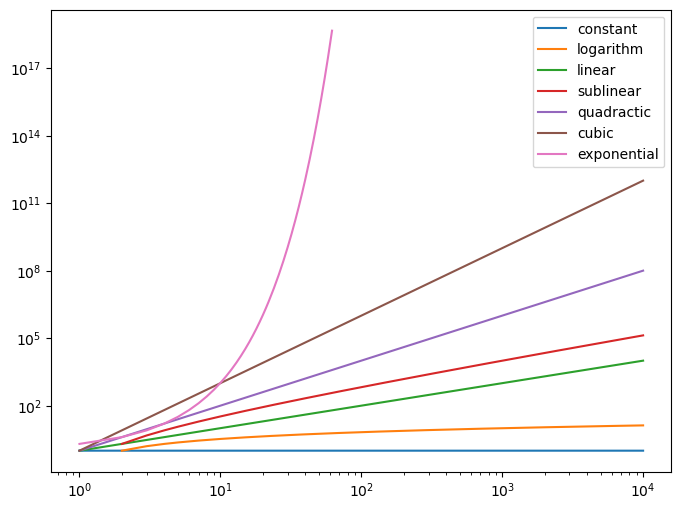

# Análise de algoritmos

- Análise de complexidade de algoritmos
    - como tamanho da entrada (n) afeta
        - tempo de execução
        - memória
    - lembra cálculo de limite
    - Notação Big O
    
https://en.wikipedia.org/wiki/Big_O_notation

https://en.wikipedia.org/wiki/Time_complexity#Table_of_common_time_complexities
  
# Principais funções assintóticas

Em ordem crescente de complexidade

| Nome | Função |
| --- | --- |
| Constante | 1 |
| Logarítmica | log n |
| Linear | n |
| Sublinear | n log n |
| Quadrática | n² |
| Cúbica | n³ |
| Exponencial | 2^n |

Ver [código do gráfico](analise_algoritmos/funcoes_assintoticas.py).

## Constante

- operações aritméticas
- expressões booleanas
- desvios condicionais
- atribuição
- max e min em vetor ordenado
- operações de pilha e fila
    - chamada de funções, por exemplo
    
## Logarítmica

- busca binária (lista ordenada)
- inserção / remoção em heap
- busca / travessia em profundidade em árvores binárias balanceadas (memória)

## Linear

- iteração (for, while)
- max, min, busca em lista não ordenada
- travessia em árvore

## Sublinear

- ordenação complexa (merge, quick, heap)
- ordenação da lib padrão

O(n² + n logn) = O(n²) < O(n³)

## Quadrática

- ordenação simples (selection, insertion, buble)
- travessia de matrix quadrada (n x n)
- iteração dentro de outra iteração

## Cúbica

- multiplicação inocente de matrix (ensino fundamental)

## Exponencial

- Fibonacci recursivo inocente
- Torre de Hanoi